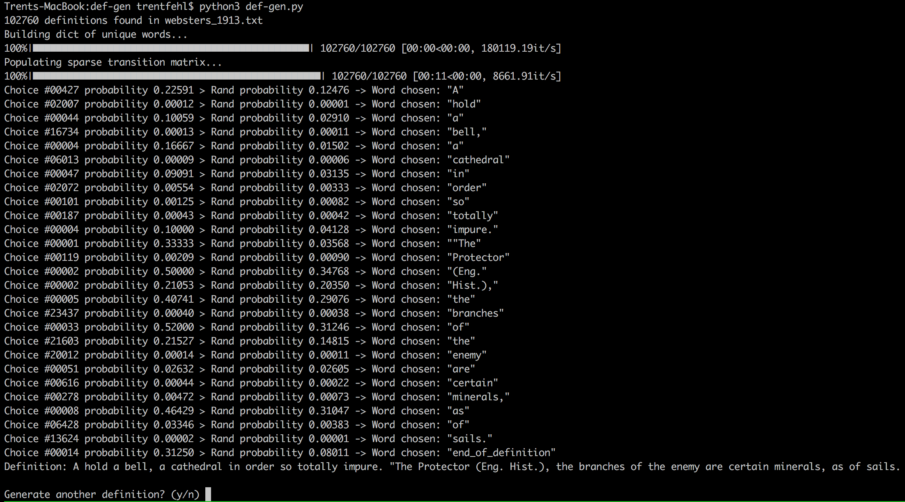

# def-gen
Definition generator that utilizes a markov chain to provide unique definitions

Test Conditions
Software: Python 3.6.4 on macOS High Sierra
Computer: MacBook (Retina, 12-inch, Early 2015)
Processor: 1.1 GHz Intel Core M
RAM: 8 GB 1600 MHz DDR3
